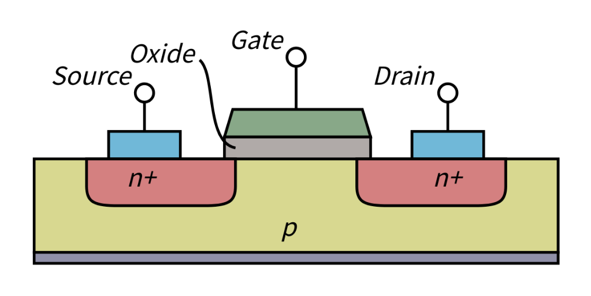
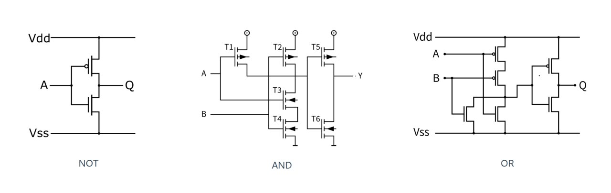
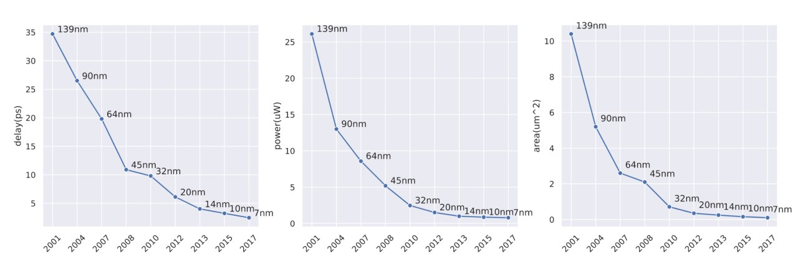
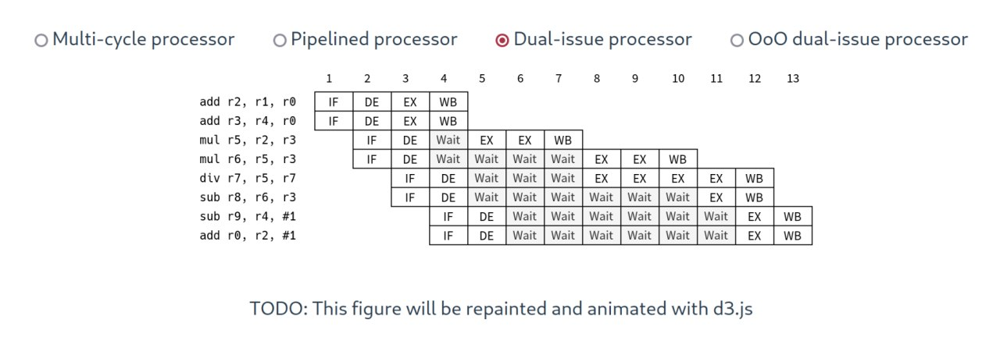
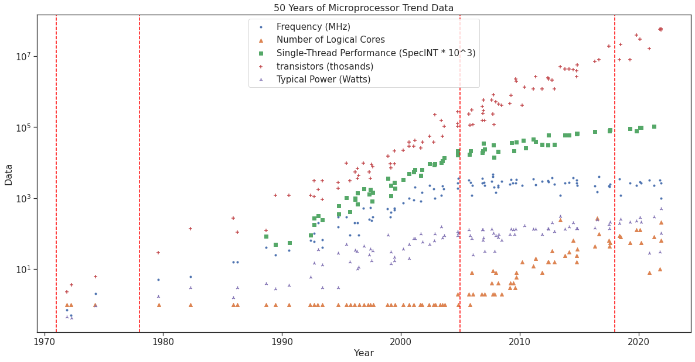
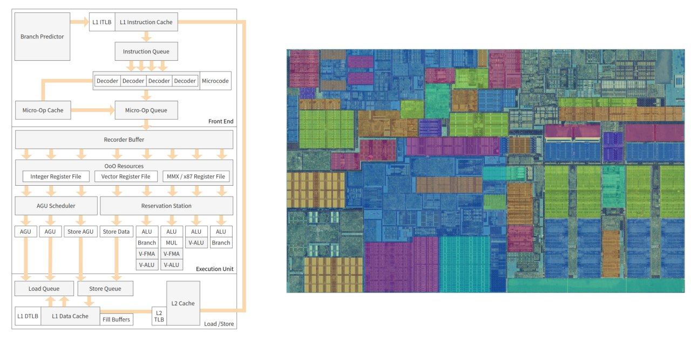
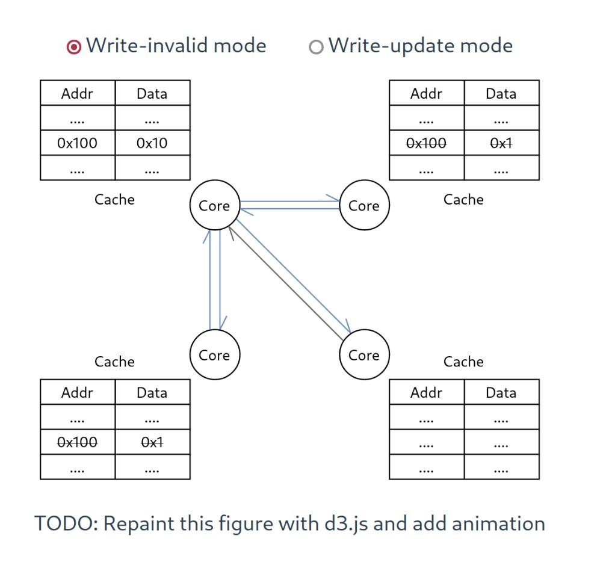
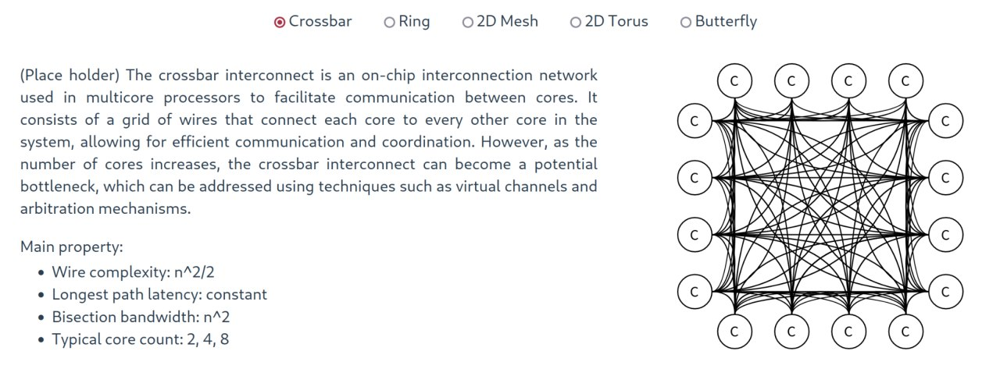
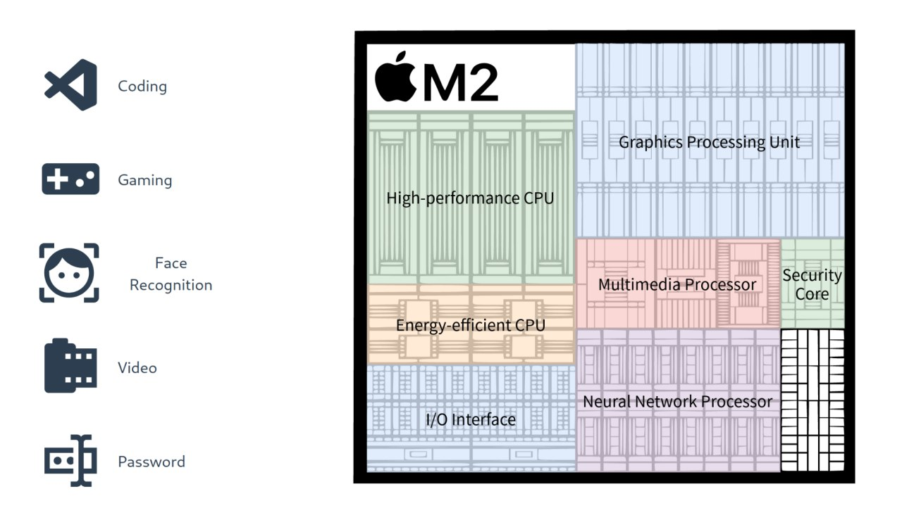
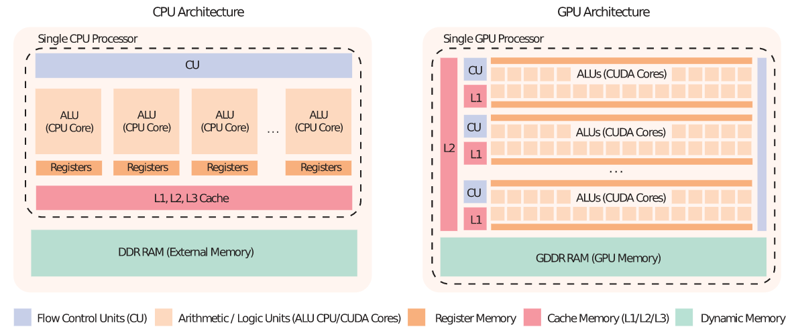

# Project Goal
As mentioned in milestone 1, we'd like to introduce people to the development of microprocessors. The journey starts from the very beginning (Complementary Metal-Oxide Semiconductor), to one of the trending microprocessors (Apple M2). As a supplement and visual aid to our story, some visualizations will be added, the sketches of which are included in the next section.  

Please check the functional prototype at https://com-480-moorelaw.github.io/ 

# Sketches
## 1. Complementary Metal-Oxide Semiconductor (CMOS)
### Goal
Showing how the CMOS work by visualizing the movement of the charge carriers inside the CMOS, and how the gate turns accordingly. 
### Effects
* When users click "Gate", the indicator would be lightened. Some charge carriers would appear in the "p" area.
* Then, users can click "Source", the charge carriers would move to "Drain", new charge carriers would appear, and "Drain" would be lightened.
* Next, if the user clicks "Gate" again, it would be closed, and all charge carriers would disappear. And if the user clicks on "source", all charge carriers would stop moving. In both cases, "Drain" would not be turned off. 
### Lectures and tools
* Lectures: JavaScript part 1, More JavaScript, Interactions, More interactive d3.js
* Tools: d3.js

## 2. NOT, AND, OR Gates
### Goal
Showing how the three kinds of gates work. Users can learn the knowledge by interacting with the inputs, and checking the outputs.
### Effects
* When the user presses the inputs (A, B), the outputs (Q, Y) would change accordingly. The opening and closing of the gates would also be indicated.
### Lectures and tools
* Lectures: JavaScript part 1, More JavaScript, Interactions, More interactive d3.js
* Tools: d3.js

## 3. Trends of CPU's delay, power, and area
### Goal
Give the user an overview of the trends of CPU's delay, power, and area. 
### Effects
* Show the line plots of all three trends. When the user hovers over the dots of the plot, the information of the corresponding CPU would be given.
* When rendering the plots, the dots would be connected one by one. Giving the user an impression of the trends.
### Lectures and tools
* Lectures: D3.js, Interactions, More interactive d3.js
* Tools: d3.js

## 4. Evolution of processors' data width
### Goal
Using a tree graph, to show the evolution of CPU's data width. At first, the scalar and vector CPUs develop separately. Then, new CPUs that support both scalar and vector appear.
### Effects
Drawing a tree graph, dynamically showing the trend of the development of CPU's data width.
### Lectures and tools
* Lectures: JavaScript 1, 2
  

## 5. Instruction processing phases
### Goal
Showing four different hardware structures, indicating their execution time differences through a code example.
### Effects
* Users can choose between different structures. An animation of the phases' flow would start after an optimization is chosen. The currently executed instructions would be marked at each phase.   
### Lectures and tools
* Lectures: D3.js, Interactions, More interactive d3.js
* Tools: d3.js

## 6. CPU trend
### Goal
Showing the development trend of microprocessors during the past 50 years. Data included are CPU's frequency, number of logical cores, single-thread performance, number of transistors, and typical power consumption. Users can grasp an overview of how CPU has developed over the years, and the development patterns. Also, the specification of a trending CPU each year would be shown.
### Effects
* When the user hovers over the dots in the scatter plot, the 5 kinds of values of the corresponding CPU would be shown.
* When a user clicks on the scatter plot, the information of a trending CPU of the mouse's X coordination will appear. 
### Lectures and tools
* Lectures: D3.js, Interactions, More interactive d3.js
* Tools: d3.js

## 7. Skylake
### Goal
Dissecting the parts of a Skylake processor, to show the users the functionality of each part of the CPU.
### Effects
* When the user hovers over an area in the die shot figure (figure on the right), the corresponding area in the architecture figure (figure on the left) would be lightened, and vice versa.
* Information (description and a line plot showing the development trend) of the corresponding area would be shown when hovered on.
### Lectures and tools
* Lectures: D3.js, Interactions, More interactive d3.js
* Tools: d3.js

## 8. Data coherence
### Goal
Inform the users of the two modes of maintaining data coherence (write-invalid mode and write-update mode). Users can see how the change of data affects the workflow of CPUs.
### Effects
* The data section in the table is editable. When the user changes the value, the core with the changed data would send out a message to other cores. In write-invalid mode, the message is an invalid flag, indicating the data is changed. In write-update mode, the message is the new data. 
### Lectures and tools
* Lectures: D3.js, Interactions, More interactive d3.js
* Tools: d3.js

## 9. Core interconnection patterns
### Goal
Showing the users several interconnection patterns of cores. Users can learn about their properties, and understand why a pattern is applied according to the usage scenario.
### Effects
* The components of the figure would change and reform smoothly when users choose between different patterns. 
### Lectures and tools
* Lectures: D3.js, Interactions, More interactive d3.js
* Tools: d3.js

## 10. Apple M2
### Goal
Showing a figure of the Apple M2 CPU, indicating the functionality of each part. We will also offer some icons representing different kinds of tasks. Users can learn which parts of the CPU are working when certain tasks are chosen.
### Effects
* When clicking on the icon, the corresponding parts of the CPU for this task will be lightened.

### Lectures and tools
* Lectures: D3.js, Interactions, More interactive d3.js
* Tools: d3.js

## 11. CPU-GPU
### Goal
Showing the users the structural differences of CPU and GPU. 
### Effects
* The figure is static.

### Lectures and tools
* Lectures: JavaScript part 1, More JavaScript 
* Tools: None
